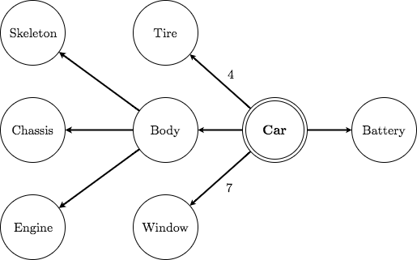
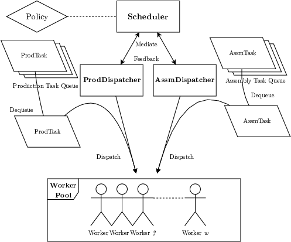
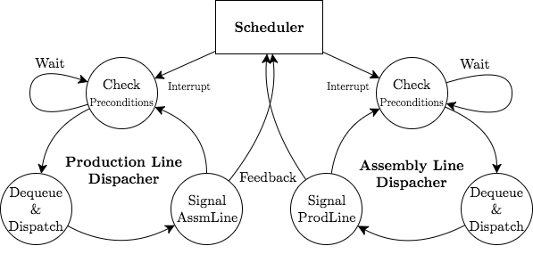
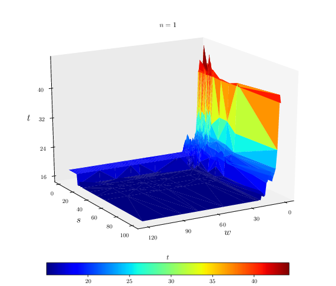
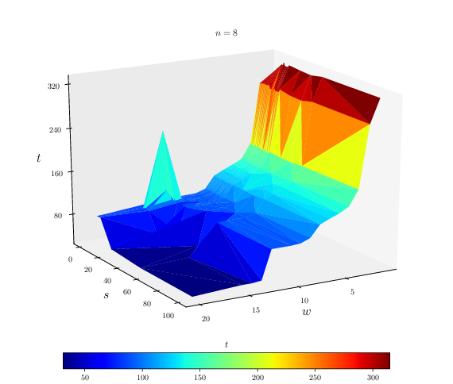
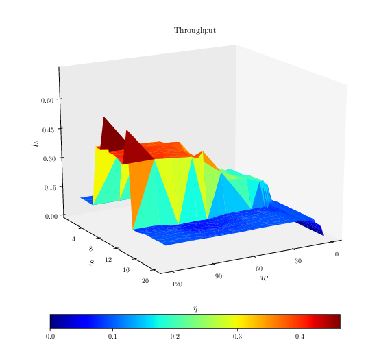
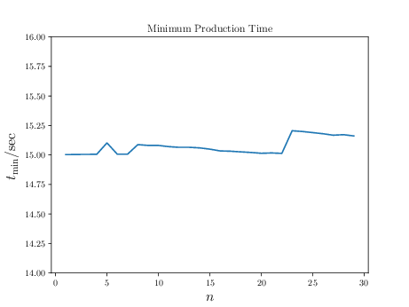

# Pamuretas

*100 workers produce 10 cars given a reasonable amount of storage spaces in ~17.14 seconds.*

**This project has a companion technical report, [learn
more](https://i.cs.hku.hk/~jyzhang/doc/pamuretas.pdf).**

## Introduction

*Pamuretas* (**Pa**rallel **Mu**lti-Dependency **Re**source-Critical **Ta**sk **S**cheduler)
is a dynamic job allocation and dispatch system that is designed to be
robust, flexible and efficient. Currently, it can only solve one particular
instance of this class of problems, but it does it very well.

### Problem Formulation

We formulate our problem as a variant to the classical costumer-producer problem
with Resource Constrained Project Scheduling Problem (RCPSP) flavour.
Concretely, given the number of workers and the goal of production, we wish to
complete production with a pre-specified amount of *storage space* such that
any component listed below occupies one space once produced; the space is
freed when it is fed into another production task as raw material.
We further assume the goal of production (i.e., cars) does not
occupy any spaces upon completion.

<table>
<tr><th>Dependency DAG</th><th>Constraints</th></tr>
<tr><td>

</td><td>

| Task     | Time/sec | Amount |
| :-:      | :-:      | :-:    |
| Skeleton | 5        | 1      |
| Engine   | 4        | 1      |
| Chassis  | 3        | 1      |
| Body     | 4        | 1      |
| Window   | 1        | 7      |
| Tire     | 2        | 4      |
| Battery  | 3        | 1      |
| Car      | 6        | --     |

</td></tr> </table>

### Features

Pamuretas has the following charming characteristics:

- Multi-Threading

    Pamuretas assumes a customized input of number of maximum threads
    that may run concurrently. It leverages the abundant working resource if and when
    possible but contemplate discreetly when facing limited resource to
    guarantee a stable performance.

- Scalability

    Pamuretas is shipped with a dedicated scheduler and two dispatchers, through
    whose delegation and feedback, Pamuretas is able to perform decently well
    no matter what task it is facing. Under most scenarios, the dynamic task
    scheduling results a nearly optimal solution.

- Robustness

    Pamuretas has two built-in systems for deadlock prevention and
    handling/recovery;
    its built-in signaling mechanism enables the feedback between dispatchers
    such that both competition and hungers between threads are minimized.

### Architecture

Pamuretas adapts the master-slave paradigm, and models the sets of individual tasks
as two FIFO queues, where they are enqueued in topological order of the DAG.

<table align="center" style="margin: 0px auto;">
<tr><th>System Architecture</th></tr>
<tr><td>

</td></tr></table>

<table align="center" style="margin: 0px auto;">
<tr><th>Work Flow</th></tr>
<tr><td>

</td></tr> </table>

The core of Pamuretas lies on its ability of delegating between the key
components, i.e., one scheduler and two dispatchers. The main working
flow is outlined above. As we shall see in the sequel, these are vital
to Pamuretas' performance and robustness.

## Usage

### Dependencies

**Important Note for MacOS Users:** the dependency `semaphore` has
deprecated in the `clang` distribution. Please do NOT run it, otherwise
unexpected error may occur.

Pamuretas is written in pure `c`, with `pthread`, `semaphore` and `omp`
libraries linked.

### Installation

First, clone this repo via `git`:

    $ git clone https://github.com/zjiayao/Pamuretas

Then we may build from the source:

    $ cd pamuretas && make

By default, we turn off the `debug` mode, which makes Pamuretas
less verbose while working, to turn it on, add the following
argument when `make`:

    $ make debug=on

This would build an executable `pamuretas`.

### Invoking from CLI

Pamuretas takes three parameters:

    $ ./pamuretas [goals] [spaces] [workers]

where all of them should be positive integers. Pamuretas
does not allow input configurations which are insolvable:

    $ ./pamuretas 1 8 1
    [Fatal] Single worker requires at least 13 space but only 8 given, abort

### Utilities

We also provide a handful of utilities for easy-benchmarking. These
are included in the `benchmarking` and `results` folder:
a `python` plotter, a `c` test-case enumerator and several `shell`
scripts for prettifying the result. Please refer to the comments therein
for usage.

## Adversarial Examples (Defended)

Here we attach a series of screencasts exhibiting
the robustness of Pamuretas under critical scenarios.

### Single Worker, Thirteen Space

This is a very critical scenario, a slight misgiving would
trap a less-carefully implemented algorithm.

*1 worker produces 1 car given critical storage spaces in ~40.02 seconds.*

### Single Space, Huge Working Force

This posts two difficulties: how to optimally use
the only one space; and how to avoid workers from
competiting with each other.

*100 workers produce 2 cars given only one storage spaces in ~38.20 seconds.*

## Benchmarking Results

Pamuretas has been thoroughly tested against over five
thousand configurations. This indeed yields some interesting
benchmarking results.

### Baseline

We first find out the time needed for one production goal
with sufficient resource:

which is about 15 seconds.

### Single/Multiple Production Goals

<table>
<tr><th colspan="2">Surface of Production Time against Worker-Space</th></tr>

<tr><td>

</td><td>

</td></tr> </table>

We note Pamuretas is able to utilize the abundant
working force and storage space rather quickly;
it also does not suffer from deadlock and alike
when very limited spaces are provided. The results
are nearly-optimal compared to the baseline computed
from last section.

When we scale up the production task, we note
the contours are nearly identical -- with
one peak appearing at low space region. This
suggested limited space posts more threats to Pamuretas.

Furthermore, at abundant resource region, the running
time of Pamuretas is near optimal and remains stable
(the plateau near the reader).

### Optimal Performance Analysis

We proceed to consider the throughput and scalability of Pamuretas.

<table>
<tr><th>Maximum Throughput (cars/sec)</th><th>Production Time with Unlimited
Resource</th></tr>

<tr><td>

</td><td>

</td></tr> </table>

First noted the plotter automatically extrapolates
the values at the boundary, hence resulting the slope
near reader. This should be ignored though. The increasing
along the diagonal of worker-space plane implies a good
scalability. Under the scenario where sufficient resources are available,
Pamuretas is able to finish the production near the optimal
time, i.e., around 15 seconds.

## Limitation and Future Work

Currently, the Worker Pool is implemented as a
vannila array. This may become the bottleneck of
the scalability, if we have tens of or thousands of
workers, say. This may be solved by implementing
a tree structure for fast indexing.

## Acknowledgment and Disclaimer

Part of this project has been submitted in partial fulfillment
for the course *Operating Systems* offered by HKU, 2017-18.
We thank [Mr. Pengfei Xu](https://github.com/FreemanX) for providing
this motivating example.
